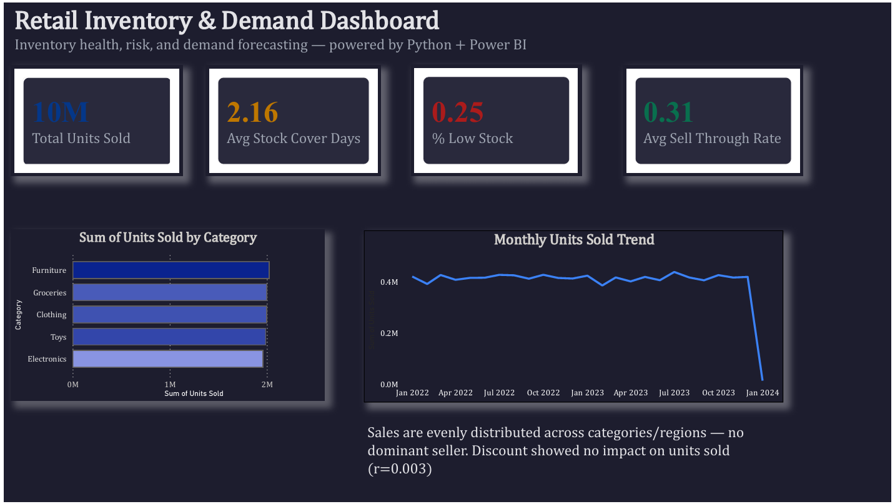
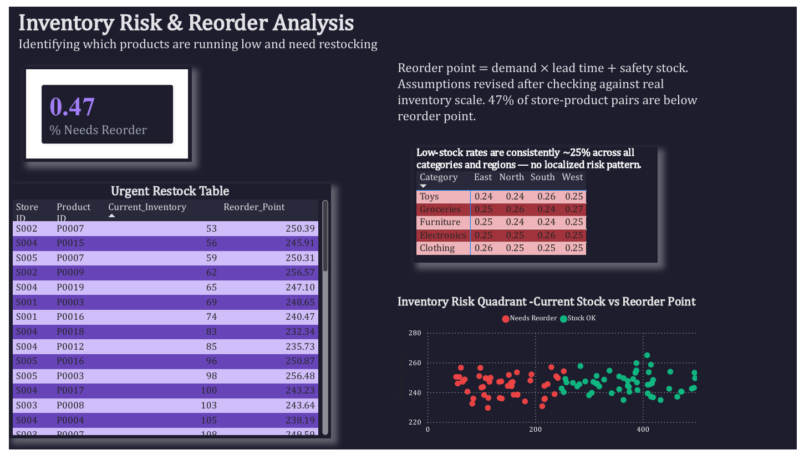
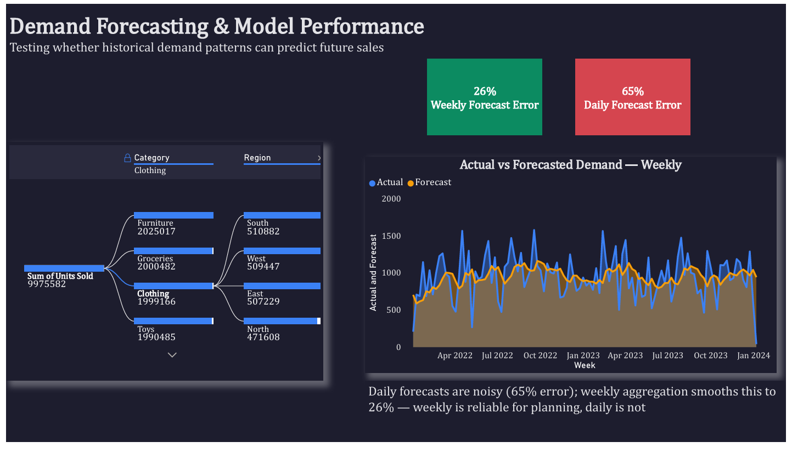

# Retail Inventory Risk & Demand Forecasting

A data analysis project investigating two operational questions for a multi-store retail business: which products are at risk of stocking out, and how far ahead can demand be reliably forecast? Built on 2 years of daily inventory and sales data across 5 stores and 20 products, using Python for exploration and modeling and Power BI for interactive visualization.

## Overview

Stockouts and overstocking both cost money — one loses sales, the other ties up capital. This project builds a data-driven reorder point system and tests how reliable demand forecasting actually is at different time horizons, so that replenishment decisions can be based on evidence rather than guesswork.

## Tools Used

- **Python (pandas, matplotlib, seaborn, scipy, statsmodels, scikit-learn)** — data cleaning, feature engineering, hypothesis testing, and demand forecasting
- **Power BI** — interactive three-page dashboard

## Key Findings

**1. Inventory risk is widespread, not localized.**
47% of store-product combinations currently sit below their calculated reorder point. This risk is spread evenly across every category and region (roughly 24-27% low-stock rate everywhere) — there is no single product line or store driving the problem, pointing to a systemic gap in the replenishment process rather than an isolated issue.

**2. Weekly forecasts are reliable; daily forecasts are not.**
An Exponential Smoothing model produced a Mean Absolute Error of 65% of average sales at the daily level, but only 26% at the weekly level. Daily demand is inherently noisy at the individual product level; aggregating to weekly totals cancels out much of that random variation — meaning replenishment decisions should be timed around weekly forecasts, not daily ones.

**3. Discounting does not drive sales volume in this business.**
Discount level showed effectively no relationship with units sold (r = 0.003) — a notably different pattern from a separate e-commerce analysis in this portfolio, where discounting had a severe negative effect on profit margin. The two findings aren't contradictory; they show that the impact of discounting is business-specific, not a universal rule.

**4. Holiday and weather effects are small and not independently actionable.**
Holiday/Promotion periods showed no meaningful sales lift. Weather showed a statistically significant effect (p = 0.012) but the practical size was only around 2% — too small to justify planning decisions on its own.

## Methodology

Data was explored and cleaned in Python, including data quality checks, feature engineering (sell-through rate, 7-day rolling average demand, stock cover days), and hypothesis testing (t-test on weather, correlation on discount). Reorder points were calculated using a standard safety-stock formula (average demand × lead time + safety stock), with lead time and service-level assumptions revised after checking them against observed inventory scale. Demand forecasting used Exponential Smoothing (Holt-Winters), validated against actual sales using Mean Absolute Error at both daily and weekly aggregation levels.

## Dashboard Preview

### Overview


### Inventory Risk & Reorder Analysis


### Demand Forecasting & Model Performance


## Repository Structure

```
├── python/
│   ├── 01_data_exploration.ipynb     # Full EDA, feature engineering, reorder logic, forecasting
│   ├── retail_store_inventory.csv    # Raw source data (Kaggle)
│   ├── inventory_analysis_full.csv   # Cleaned data with engineered features
│   ├── at_risk_products.csv          # Products below reorder point
│   ├── weekly_forecast.csv           # Actual vs forecasted weekly demand
│   ├── monthly_sales.csv             # Monthly sales rollup
│   └── reorder_comparison_full.csv   # Full reorder point comparison
├── powerbi/
│   └── retail_dashboard.pbix         # Full interactive Power BI file
├── reports/
│   ├── Retail_Dashboard.pdf          # Static PDF export of all 3 pages
│   ├── Retail_Insight_Report.pdf     # Full written findings and recommendations
│   └── Retail_BRD.docx               # Business Requirements Document — Automated Reorder Alert System
├── images/
│   └── (dashboard page screenshots)
└── README.md
```

## Skills Demonstrated

- Python: pandas for data cleaning and feature engineering, hypothesis testing (scipy), time-series forecasting (statsmodels), model evaluation (scikit-learn)
- Statistical reasoning: t-tests, correlation analysis, distinguishing statistical significance from practical significance
- Demand forecasting: Exponential Smoothing, MAE-based model evaluation, daily vs weekly aggregation trade-offs
- Power BI: multi-page dashboard design, decomposition trees, conditional formatting, KPI cards
- Business analysis: translating forecasting and inventory findings into a buildable system specification (BRD)
- Documented, iterative analytical judgment — revising assumptions (lead time, service level) based on evidence rather than keeping initial guesses

## Author

Amrutha K
[LinkedIn](https://linkedin.com/in/amrutha-k-ravi) | [GitHub](https://github.com/Amrutharavindran)
